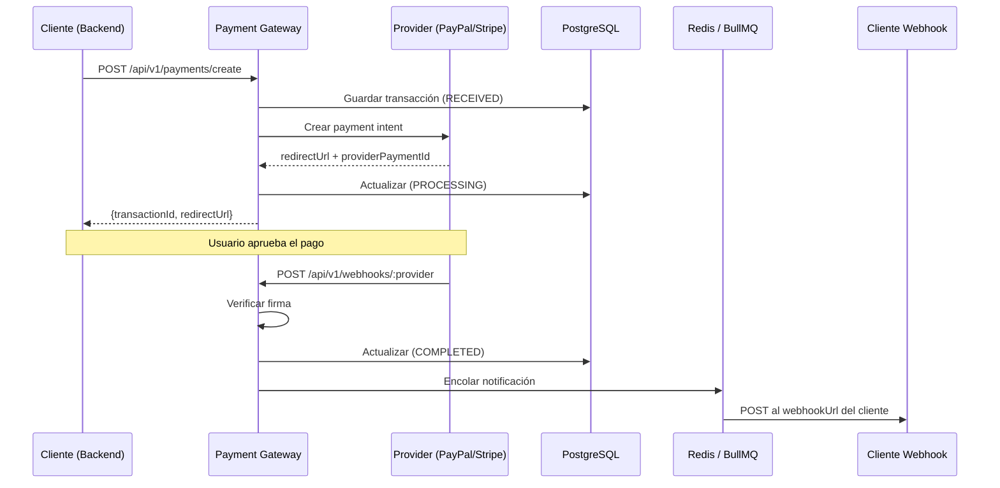

# 💳 Payment Gateway

Microservicio de pasarela de pagos construido con Node.js, Express y PostgreSQL. Soporta múltiples proveedores de pago (PayPal, Stripe) con una API unificada, notificaciones asíncronas vía webhooks, y procesamiento en cola con BullMQ.

## 🏗️ Stack Tecnológico

| Componente | Tecnología |
|---|---|
| Runtime | Node.js 20 (ES Modules) |
| Framework | Express 5 |
| Base de datos | PostgreSQL 15 (Sequelize 6) |
| Cache / Colas | Redis 7 (BullMQ) |
| Validación | Zod |
| Logging | Pino |
| Contenedores | Docker + Docker Compose |

## 📐 Arquitectura



## 📋 Requisitos Previos

- [Node.js](https://nodejs.org/) 20+
- [Docker](https://www.docker.com/) & Docker Compose
- Cuenta de [PayPal Developer](https://developer.paypal.com/) (sandbox)
- Cuenta de [Stripe](https://stripe.com/) (opcional)

## 🚀 Instalación Rápida

```bash
# 1. Clonar el repositorio
git clone https://github.com/Enma586/payment.git
cd payment-gateway

# 2. Copiar variables de entorno
cp .env.example .env

# 3. Editar .env con tus credenciales
#    (PAYPAL_CLIENT_ID, PAYPAL_CLIENT_SECRET, etc.)

# 4. Levantar con Docker
docker compose up -d --build

# 5. Verificar
curl http://localhost:3000/health
```

Las migraciones de base de datos se ejecutan automáticamente al iniciar el contenedor.

## 🔧 Variables de Entorno

| Variable | Requerida | Descripción | Default |
|---|---|---|---|
| `PORT` | No | Puerto del servidor | `3000` |
| `BASE_URL` | No | URL base del servicio | `http://localhost:3000` |
| `NODE_ENV` | No | Entorno de ejecución | `development` |
| `DB_USER` | Sí | Usuario PostgreSQL | — |
| `DB_PASSWORD` | Sí | Password PostgreSQL | — |
| `DB_NAME` | Sí | Nombre de la base de datos | — |
| `DB_HOST` | Sí | Host de PostgreSQL | `postgres_db` |
| `REDIS_HOST` | No | Host de Redis | `localhost` |
| `REDIS_PORT` | No | Puerto de Redis | `6379` |
| `WEBHOOK_SECRET` | Sí | Secreto HMAC para firmar notificaciones | — |
| `SERVICE_API_KEY` | Sí | API key para autenticar requests entre servicios | — |
| `ALLOWED_ORIGINS` | No | Orígenes CORS permitidos (separados por coma) | — |
| `LOG_LEVEL` | No | Nivel de logging | `info` |
| `PAYPAL_CLIENT_ID` | No* | Client ID de PayPal | — |
| `PAYPAL_CLIENT_SECRET` | No* | Client Secret de PayPal | — |
| `PAYPAL_WEBHOOK_ID` | No* | Webhook ID de PayPal | — |
| `PAYPAL_API_URL` | No | URL de la API de PayPal | `https://api-m.sandbox.paypal.com` |
| `PAYPAL_SKIP_VERIFY` | No | Saltar verificación de firma (solo sandbox) | `false` |
| `STRIPE_SECRET_KEY` | No* | Secret key de Stripe | — |
| `STRIPE_WEBHOOK_SECRET` | No* | Webhook signing secret de Stripe | — |

*\*Al menos un proveedor debe estar configurado.*

## 📡 API Endpoints

Todos los endpoints (excepto webhooks de proveedores) requieren el header:

```
x-api-key: <SERVICE_API_KEY>
```

### Crear un pago

```bash
POST /api/v1/payments/create
```

```json
{
  "amount": 1000,
  "currency": "USD",
  "provider": "paypal",
  "paymentMethod": "card",
  "returnUrl": "https://tusitio.com/success",
  "cancelUrl": "https://tusitio.com/cancel",
  "idempotencyKey": "ik_orden_12345",
  "metadata": {
    "webhookUrl": "https://tusitio.com/webhooks/payment",
    "orderId": "ORD-001"
  }
}
```

Respuesta:
```json
{
  "status": "success",
  "data": {
    "transactionId": "a1b2c3d4-...",
    "providerPaymentId": "5O190127TN364715T",
    "redirectUrl": "https://www.sandbox.paypal.com/checkoutnow?token=...",
    "status": "PROCESSING"
  }
}
```

### Consultar estado

```bash
GET /api/v1/payments/:id/status
```

Respuesta:
```json
{
  "status": "success",
  "data": {
    "id": "a1b2c3d4-...",
    "externalId": "tx_12345_abc",
    "provider": "paypal",
    "providerPaymentId": "5O190127TN364715T",
    "paymentMethod": "card",
    "amount": 1000,
    "currency": "USD",
    "status": "COMPLETED",
    "createdAt": "2026-04-24T12:00:00.000Z",
    "updatedAt": "2026-04-24T12:05:00.000Z"
  }
}
```

### Reembolsar un pago

```bash
POST /api/v1/payments/:id/refund
```

```json
{
  "amount": 500,
  "reason": "Customer requested partial refund"
}
```

Respuesta:
```json
{
  "status": "success",
  "data": {
    "transactionId": "a1b2c3d4-...",
    "refundId": "REFUND-123",
    "status": "COMPLETED",
    "amount": 500
  }
}
```

> Si `amount` se omite, se reembolsa el monto total.

### Listar métodos de pago disponibles

```bash
GET /api/v1/methods
```

Respuesta:
```json
{
  "status": "success",
  "data": [
    { "name": "paypal", "methods": ["card", "paypal"] },
    { "name": "stripe", "methods": ["card", "apple_pay", "google_pay"] }
  ]
}
```

### Webhooks de proveedores

Los proveedores envían eventos aquí (sin API key, verifican su propia firma):

```bash
POST /api/v1/webhooks/paypal    # PayPal
POST /api/v1/webhooks/stripe    # Stripe
```

### Health Check

```bash
GET /health
```

```json
{ "status": "UP", "timestamp": "2026-04-24T12:00:00.000Z" }
```

## 📁 Estructura del Proyecto

```
payment-gateway/
├── config/
│   └── config.js              # Configuración Sequelize CLI
├── migrations/
│   ├── 20260418-create-transactions.js
│   ├── 20260422-add-provider-fields.js
│   ├── 20260424-add-webhook-url.js
│   └── 20260424-add-refunded-status.js
├── src/
│   ├── config/
│   │   ├── database.js        # Conexión PostgreSQL (Sequelize)
│   │   ├── redis.js           # Conexión Redis (ioredis)
│   │   └── index.js           # Barrel exports
│   ├── controllers/
│   │   ├── paymentController.js
│   │   └── webhookController.js
│   ├── lib/
│   │   └── logger.js          # Pino logger
│   ├── middlewares/
│   │   ├── errorHandler.js
│   │   ├── validateSchema.js
│   │   ├── verifyApiKey.js
│   │   └── verifySignature.js
│   ├── models/
│   │   ├── index.js           # Barrel exports
│   │   └── Transaction.js     # Modelo Sequelize
│   ├── providers/
│   │   ├── provider.interface.js  # Clase abstracta
│   │   ├── registry.js        # Registro singleton de providers
│   │   ├── paypal/
│   │   │   └── paypal.provider.js
│   │   └── stripe/
│   │       └── stripe.provider.js
│   ├── routes/
│   │   ├── index.js           # Router principal
│   │   ├── paymentRoutes.js
│   │   ├── webhookRoutes.js
│   │   └── methodRoutes.js
│   ├── schemas/
│   │   ├── createPaymentSchema.js
│   │   ├── refundSchema.js
│   │   ├── paymentSchema.js
│   │   └── notificationSchema.js
│   ├── services/
│   │   ├── transactionService.js  # Lógica principal
│   │   ├── paymentService.js      # Procesamiento de webhooks legacy
│   │   └── queueService.js        # BullMQ queue
│   └── workers/
│       └── paymentWorker.js   # Worker de notificaciones
├── tests/
│   └── unit/
│       ├── schemas/
│       ├── middlewares/
│       ├── services/
│       └── providers/
├── docker-compose.yaml        # Desarrollo
├── docker-compose.prod.yaml   # Producción
├── Dockerfile
├── docker-entrypoint.sh       # Migraciones auto al iniciar
├── package.json
└── server.js                  # Entry point
```

## 🔌 Agregar un Nuevo Provider

1. Crear `src/providers/nuevoprovider/nuevoprovider.provider.js` extendiendo `PaymentProvider`:

```js
import { PaymentProvider } from '../provider.interface.js';

export class NuevoProvider extends PaymentProvider {
  getProviderName() { return 'nuevoprovider'; }
  getSupportedMethods() { return ['card']; }
  async createPayment(data) { /* ... */ }
  async verifyWebhook(rawBody, headers) { /* ... */ }
  parseWebhookEvent(event) { /* ... */ }
  async getPaymentStatus(providerPaymentId) { /* ... */ }
  async refundPayment(providerPaymentId, amount) { /* ... */ }
  mapStatus(providerStatus) { /* ... */ }
}
```

2. Registrar en `src/providers/registry.js`:

```js
import { NuevoProvider } from './nuevoprovider/nuevoprovider.provider.js';

if (process.env.NUEVO_API_KEY) {
  registry.register(new NuevoProvider());
}
```

3. Agregar variables de entorno en `.env`.

## 🧪 Testing

```bash
# Correr todos los tests
npm test

# Modo watch (desarrollo)
npm run test:watch

# Coverage
npm run test:coverage
```

## 🚢 Despliegue a Producción

```bash
# 1. Configurar .env.production con credenciales reales

# 2. Levantar
docker compose -f docker-compose.prod.yaml up -d --build

# 3. Verificar
docker compose -f docker-compose.prod.yaml logs app
```

Diferencias con desarrollo:
- Puerto enlazado solo a `127.0.0.1`
- Restart policy `always`
- Redis con password
- PostgreSQL sin exponer puerto
- Logging con rotación (10MB, 3 archivos)
- SSL en conexión PostgreSQL

## 🔒 Seguridad

- **API Key** (`x-api-key`) para autenticar requests entre microservicios
- **HMAC-SHA256** para firmar notificaciones salientes al cliente (`X-Signature`)
- **Verificación de firma** en webhooks entrantes (PayPal y Stripe)
- **Rate limiting** en endpoints de webhook (100 req/min)
- **CORS** restringido a orígenes configurados
- **Idempotencia** para evitar pagos duplicados
- **Usuario no-root** en el contenedor Docker

## 📄 Licencia

ISC